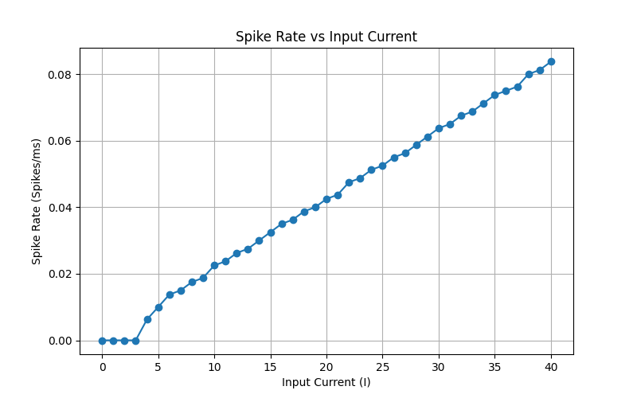

# neuron-simulation-izhikevich
This project simulates the behavior of neurons using the **Izhikevich Model**, specifically focusing on Regular Spiking (RS) neurons. The simulation is implemented in Python and visualizes how neurons respond to varying levels of external input currents.




## Project Structure
```
NEURON-SIMULATION-IZHIKEVICH/
│
├── env/                   # (Optional) Virtual environment folder
├── figures/               # Contains generated plots
│   ├── Figure_1.png
│   ├── membrane_potencial.png
│   ├── result_llm.png
│   └── Spike rate vs input current.png
│
├── methods/
│   ├── izhikevich.py       # Implements the Izhikevich neuron model
│   └── utils.py            # Helper functions for plotting
│
├── main.py                # Main script to run the simulation
├── llm.py                 # Simulation creating by Mistral AI
├── README.md              # Project instructions
└── requirements.txt       # Python dependencies
```

## Requirements

To run this project, you'll need to have the following dependencies installed:

- `numpy`
- `matplotlib`

You can install them manually or use the provided `requirements.txt` file to set up your environment.

### Setting up dependencies:

1. **Create a virtual environment (optional but recommended)**:
   ```bash
   python3 -m venv env
   source env/bin/activate  # On Mac/Linux
   env\Scripts\activate     # On Windows
   ```

2. **Install dependencies**:
   ```bash
   pip install -r requirements.txt
   ```

## How to Run the Simulation

1. **Clone the repository** (or navigate to the project directory):
   ```bash
   git clone https://github.com/AdonaiVera/neuron-simulation-izhikevich.git
   cd neuron-simulation-izhikevich

   ```

2. **Run the simulation**:
   ```bash
   python main.py
   ```

3. **Run the simulation using the LLM script**:
   ```bash
   python main.py
   ```

## Output

Running the code will produce two main results:

1. **Membrane Potential for I = 1, 10, 20, 30, 40**:
   This will plot the membrane potential (`v`) over time for the given input current values.

2. **Spike Rate vs Input Current**:
   This graph will plot the spike rate (`R`) as a function of input current (`I`), showing how the neuron responds to varying external inputs.

All the figures are saved in the `figures/` directory.

## Figures
1. **Membrane Potential**: Shows the membrane potential (`v`) for different levels of input current (`I = 1, 10, 20, 30, 40`).
2. **Spike Rate vs Input Current**: Demonstrates the relationship between input current and neuron spiking rate.

## Authors 
Adonai Vera
Ali Minai